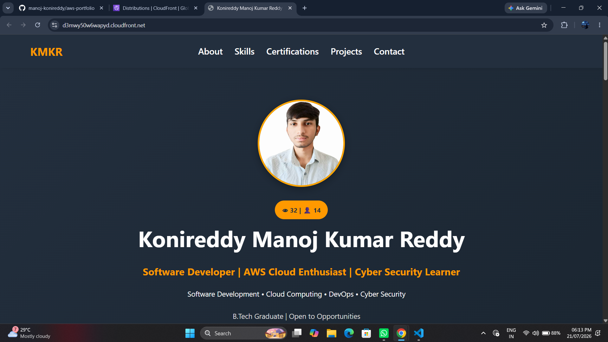
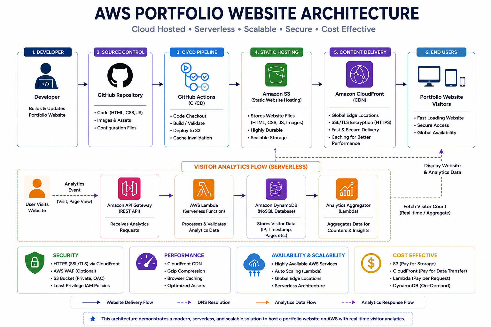

# ☁️ AWS Portfolio Website

<p align="center">
  
</p>


A modern, fully responsive portfolio website built and deployed on Amazon Web Services to showcase my projects, technical skills, certifications, and cloud expertise. The application demonstrates practical AWS cloud deployment, serverless architecture, responsive web development, and real-time visitor analytics.

---

## 🌐 Live Demo

### AWS CloudFront (Production)

🔗 https://d3mwy50w6wapyd.cloudfront.net

### GitHub Pages (Mirror)

🔗 https://manoj-konireddy.github.io/portfolio/

---

## ✨ Highlights

- Responsive design for Desktop, Tablet, and Mobile
- Professional project showcase
- Individual project pages with architecture diagrams
- Interactive image gallery with fullscreen viewer
- Serverless real-time visitor analytics
- Certifications section
- Resume download
- GitHub & LinkedIn integration
- Modern and clean UI

---

## ☁️ AWS Architecture

<p align="center">
  
</p>

---

## 🛠️ Technology Stack

### Frontend

- HTML5
- CSS3
- JavaScript
- Responsive Web Design

### AWS Cloud

- Amazon S3
- Amazon CloudFront
- AWS Lambda
- Amazon API Gateway
- Amazon DynamoDB
- AWS IAM

### Development Tools

- Git
- GitHub
- VS Code

---

## 📂 Featured Projects

- AWS Portfolio Website
- AWS File Sharing Platform
- AWS Image Compressor Pipeline
- Web Security Analyzer
- Forward Deployed Engineer
- Play-to-Payout Engine

---

## 📁 Project Structure

```
aws-portfolio/
│
├── index.html
├── style.css
├── gallery.js
├── architecture/
├── certificates/
├── images/
├── projects/
├── screenshots/
└── README.md
```

---

## 🚀 Features

### Portfolio

- Professional landing page
- Responsive navigation
- Skills section
- Certifications
- Contact section
- Resume download

### Projects

- Dedicated project pages
- Architecture diagrams
- Technology stack
- Key features
- Challenges & solutions
- Live demo links
- GitHub repository links

### Visitor Analytics

- Real-time page view counter
- Unique visitor tracking
- REST API integration
- Serverless backend powered by AWS Lambda
- Visitor statistics stored in Amazon DynamoDB

---

## 📚 Learning Outcomes

Through this project, I gained hands-on experience in:

- AWS Cloud Deployment
- Serverless Architecture
- GitHub Actions CI/CD
- CloudFront CDN
- Static Website Hosting
- API Development
- AWS Lambda
- DynamoDB
- IAM
- Responsive Web Design
- Frontend Development
- Cloud Integration

---

## 🔮 Future Improvements

- Custom Domain Integration
- SSL/TLS using AWS Certificate Manager (ACM)
- AWS CloudWatch Monitoring
- Infrastructure as Code (Terraform / AWS CDK)

---

## 👨‍💻 Author

**Konireddy Manoj Kumar Reddy**

- GitHub: https://github.com/manoj-konireddy
- LinkedIn: https://www.linkedin.com/in/manoj-konireddy

---

## ⭐ Support

If you found this project helpful, please consider giving it a ⭐ on GitHub.

It helps others discover the project and motivates me to continue building cloud-based applications.